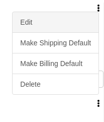

# react-overflow-menu

React component for overflow menu styled in bootstrap

## Example



```html
<!-- Put bootstrap cdn link (like below) in index.html of your React App -->
<!-- Latest compiled and minified CSS -->
<link
  rel="stylesheet"
  href="https://stackpath.bootstrapcdn.com/bootstrap/3.4.1/css/bootstrap.min.css"
  integrity="sha384-HSMxcRTRxnN+Bdg0JdbxYKrThecOKuH5zCYotlSAcp1+c8xmyTe9GYg1l9a69psu"
  crossorigin="anonymous"
/>
```

```jsx
import React, { Component } from 'react';
import OverflowMenu from 'react-overflow-menu';

// Mention your own menu items (only 'id' and 'text' are supported)
const menuItems = [
  { id: 'edit', text: 'Edit' },
  { id: 'delete', text: 'Delete' }
];

class App extends Component {
  menuItemClick = e => console.log('App', e.target.id); // Write your own logic

  render() {
    return (
      <div>
        OverflowMenu
        <br />
        <div className="container">
          <table style={{ width: '50%' }}>
            <tr>
              <td>Demo</td>
            </tr>
            <tr>
              <td>
                <OverflowMenu
                  className="text-right"
                  menuItems={menuItems}
                  menuItemClick={this.menuItemClick}
                />
              </td>
            </tr>
          </table>
        </div>
      </div>
    );
  }
}

export default App;
```

## Install

```cli
npm install react-overflow-menu
```

## Props

##### `className`

Sets the class name (bootstrap class) of the overflow menu. Defaults to `text-right`. Valid values are:

`text-left | text-center | text-right` :: Alignment of the overflow menu

---

##### `menuItems`

An array of object with properties like 'id' and 'text'.
```js
const menuItems = [
  { id: 'edit', text: 'Edit' },
  { id: 'delete', text: 'Delete' }
];
```

---

##### `menuItemClick`

A callback function to get event object of a button of a menu item.

## License

MIT
